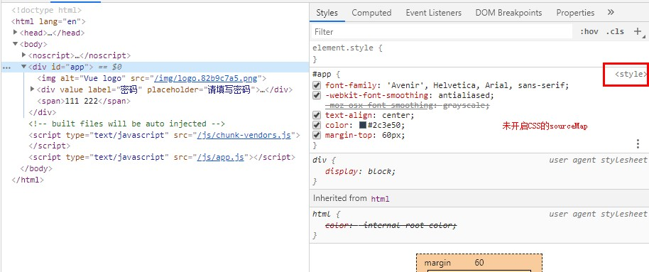
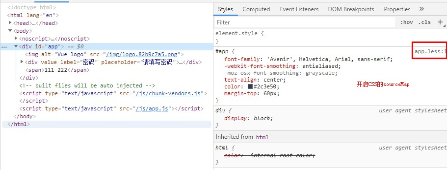
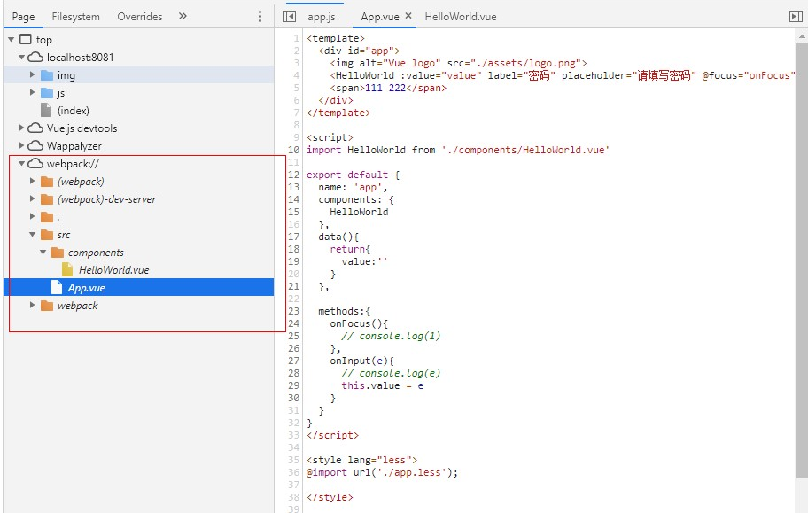

## vue-cli3的配置参考

> :sunny: 初衷：关于vue-cli3配置参考，google出来的结果大多不理想。所以自己收集捣鼓总结vue-cli3-config-reference。  

> :soon: [vue-cli](https://github.com/vuejs/vue-cli/releases)在2019-11-27发布了新版本v4.1.0，后续会新开vue-cli4的分支，记录总结config-reference。  

> :on: 以下例子均基于@vue/cli v3.11.0
```
$ vue --version
3.11.0
```

### :bookmark_tabs:目录
* [:heavy_check_mark:取消eslint错误显示在浏览器中](#ballot_box_with_check取消eslint错误显示在浏览器中)
* [:heavy_check_mark:启用bundle分析工具](#ballot_box_with_check启用bundle分析工具)
* [:heavy_check_mark:lodash按需引入](#ballot_box_with_checklodash按需引入)
* [:heavy_check_mark:moment按需引入语言包](#ballot_box_with_checkmoment按需引入语言包)
* [:heavy_check_mark:启用静态压缩](#ballot_box_with_check启用静态压缩)
* [:heavy_check_mark:启用js和css的sourceMap](#ballot_box_with_check启用js和css的sourceMap)
* [:heavy_check_mark:DllPlugin配置](#ballot_box_with_checkDllPlugin配置)
* [:heavy_check_mark:添加别名alias](#ballot_box_with_check添加别名alias)
* [:heavy_check_mark:去除console.log](#ballot_box_with_check去除consolelog)
* [:heavy_check_mark:配置CSS Modules](#ballot_box_with_check配置css-modules)
* [:heavy_check_mark:向所有 Less 样式传入共享的全局变量](#ballot_box_with_check向所有-less-样式传入共享的全局变量)
* [:heavy_check_mark:向所有 Scss 样式传入共享的全局变量](#ballot_box_with_check向所有-scss-样式传入共享的全局变量)
* [:heavy_check_mark:向所有 Sass 样式传入共享的全局变量](#ballot_box_with_check向所有-sass-样式传入共享的全局变量)
* [:heavy_check_mark:向所有 Stylus 样式传入共享的全局变量](#ballot_box_with_check向所有-stylus-样式传入共享的全局变量)
* [:heavy_check_mark:配置proxy代理解决跨域](#ballot_box_with_check配置proxy代理解决跨域)
* [:heavy_check_mark:解决第三方包的IE11兼容](#ballot_box_with_check解决第三方包的IE11兼容)
* [:heavy_check_mark:使用web worker](#ballot_box_with_check使用web-worker)


### :ballot_box_with_check:取消eslint错误显示在浏览器中
运行```vue create```新建的项目，默认的```lintOnSave:'error'```，lint 错误不仅仅输入到命令行，也直接显示在浏览器中。设置```lintOnSave:true```即可。  
  * true：```eslint-loader``` 会将 lint 错误输出为编译警告。默认情况下，警告仅仅会被输出到命令行，且不会使得编译失败。
  * 'error'：这会强制 ```eslint-loader``` 将 lint 错误输出为编译错误，同时也意味着 lint 错误将会导致编译失败。
  * false：取消eslint检查。
```js
// vue.config.js
module.exports = {
  lintOnSave: true
}
```
tip：修改配置重启后，如无效果，需要Ctrl+s保存文件，触发检查。  

参考：[vue-cli3文档#lintonsave](https://cli.vuejs.org/zh/config/#lintonsave)  

[:arrow_up:回到顶部](#vue-cli3的配置参考)

### :ballot_box_with_check:启用bundle分析工具
```
$ vue add webpack-bundle-analyzer
```
不需要配置任何script，在build的时候加上--report即可。在开发环境中，默认自动打开```http://127.0.0.1:8888```，查看分析报告，由于 ```webpack-bundle-analyzer``` 需要物理文件来计算已解析和gzip压缩的大小，因此只能使用stat大小；如果运行```npm run build --report```，dist目录下会生成report.html，默认自动打开该文件。  
关闭自动打开分析文件功能：
```js
// vue.config.js
module.exports = {
  pluginOptions: {
    webpackBundleAnalyzer: {
      openAnalyzer: false
    }
  }
}
```
参考：[vue-cli-plugin-webpack-bundle-analyzer](https://www.npmjs.com/package/vue-cli-plugin-webpack-bundle-analyzer)  

[:arrow_up:回到顶部](#vue-cli3的配置参考)

### :ballot_box_with_check:lodash按需引入
1. 只安装并引入你需要的lodash包
```
$ yarn remove lodash
$ yarn add lodash.clonedeep -S
```
```js
//在需要的地方引入
import cloneDeep from "lodash.clonedeep";
```
2. 使用babel-plugin-lodash
```
$ yarn add babel-plugin-lodash -D
```
修改.babelrc文件：
```json
{
    "plugin":["lodash"]
}
```
3. 使用lodash-es  
webpack的 ```tree-shaking``` 只对es6模块生效，而lodash本身是commonjs模块，所以```import { cloneDeep } from "lodash"```是实现不了按需加载的，但是它有一个lodash-es版本，用的就是es6模块。 
```
$ yarn add lodash-es -S
```
```js
import { cloneDeep } from 'lodash-es' 
// 相当于 import cloneDeep from "lodash.clonedeep";
```
[:arrow_up:回到顶部](#vue-cli3的配置参考)

### :ballot_box_with_check:moment按需引入语言包
moment支持123种语言，但它又不能事先知道你需要哪一种语言包，保险起见，打包的时候会把所有的语言包打包进去。默认是en，所以en这个语言包是肯定会自动打包进去的。
```js
// 国际化示例
moment.locale('zh-cn')
moment().format('LLL')  // 2019年11月19日早上8点46分

moment.locale('en')
moment().format('LLL')  // November 19, 2019 8:48 AM
```
webpack-bundle-analyzer分析图如下： 

<div align="center"></div>

1. 按需引入语言包  
```js
// vue.config.js，下面只引入中国和中国香港的语言包，可根据自身需求引入
const webpack = require('webpack')

module.exports = {
  chainWebpack: config => {
    config
      .plugin('ignore')
      .use(new webpack.ContextReplacementPlugin(/moment[/\\]locale$/, /(zh-cn)|(zh-hk)$/))
    return config
  }
}
```
2. 忽略所有语言包，并使用import单独引入特定语言包
```js
// vue.config.js
const webpack = require('webpack');
module.exports = {
  chainWebpack: config => {
    config
      .plugin('ignorePlugin')
      .use(webpack.IgnorePlugin, [{     // 引入的文件路径匹配/^\.\/locale$/，则会忽略这个文件， 也就不会被打包进去
        resourceRegExp: /^\.\/locale$/, // 忽略所有语言包，所有locale功能失效，功能缺失那肯定是不允许的。在main.js单独引入语言包即可
        contextRegExp: /moment$/,
      }]);
  }
}
```
```js
//main.js
import moment from 'moment'
import 'moment/locale/zh-cn'
moment.locale('zh-cn')
console.log(moment().format('LLL')) // 2019年11月19日早上8点46分
```
3. 使用date-fns或dayjs替代

|    名字    | 大小(gzip) |支持Tree-shaking|api方法数|时区支持|支持语言数|
| ---------- | ---  |---| ---------- | ---  |---|
| [Moment.js](https://momentjs.com/) |  329K(69.6K) |No|高|非常好|123|
| [date-fns](https://date-fns.org/)       |  78.4k(13.4k) without tree-shaking |YES|高|还不支持|32|
|[dayjs](https://github.com/iamkun/dayjs)|6.5k(2.6k) without plugins|No|中|还不支持|23|

[:arrow_up:回到顶部](#vue-cli3的配置参考)

### :ballot_box_with_check:启用静态压缩
启用压缩分为动态压缩和静态压缩。
* 动态压缩是由nginx对每个请求进行压缩， 缺点是压缩过程占用cpu的资源，压缩比越高cpu占用越高，不需要修改webpack配置，修改nginx.conf文件即可。
* 静态压缩：使用compression-webpack-plugin对打包文件进行压缩，会生成对应的.gz文件。nginx发现存在对应的.gz文件后，会使用该压缩文件，就不需要自己压缩一遍了。
```
yarn add compression-webpack-plugin -D
```
```js
// vue.config.js
const CompressionPlugin = require('compression-webpack-plugin')
module.exports = {
  configureWebpack: config => {
    if (process.env.NODE_ENV === 'production') {
      config.mode = 'production'
      return {
        plugins: [new CompressionPlugin({
          test: /\.js$|\.html$|\.css/,
          threshold: 10240,//大于10kb的就进行压缩
          deleteOriginalAssets: false //是否删除源文件
        })]
      }
    }
  }
}
```
配置nginx，在http、server、location下加以下代码：
```
# 开启静态压缩
gzip_static on; 
#识别http的协议版本。由于早期的一些浏览器或者http客户端，可能不支持gzip自解压，用户就会看到乱码，所以做一些判断还是有必要的
gzip_http_version   1.1; 
# 启用压缩，如果header包含expired no-cache no-store private auth其中一种
gzip_proxied        expired no-cache no-store private auth; 
# 不启用压缩的条件，IE6对Gzip不友好，所以不压缩
gzip_disable        "MSIE [1-6]\."; 
# 和http头有关系，加个vary头，给代理服务器用的，有的浏览器支持压缩，有的不支持，所以避免浪费不支持的也压缩，所以根据客户端的HTTP头来判断，是否需要压缩
gzip_vary  on;
```
如果使用的是node和express，在需要启用静态压缩的中间件前注册一个中间价即可:
```js
const compression = require('compression')
app.use(compression())
```

如需启用开发环境的静态压缩，配置devServer即可：
```js
// vue.config.js
module.exports = {
  devServer:{
    compress: true
  }
}
```

参考：[webpack官网 devServer.compress](https://webpack.docschina.org/configuration/dev-server/#devserver-compress)  

[:arrow_up:回到顶部](#vue-cli3的配置参考)

### :ballot_box_with_check:启用js和css的sourceMap
#### css.sourceMap
为CSS开启sourceMap后，在检索元素查看css时，可以精确知道来自于哪一个文件，点击文件名，可以到达Sources面板查看该文件。

<div align="center"></div>
<div align="center"></div>

```js
// vue.config.js
module.exports = {
  css: {
    sourceMap: false
  }
}
```
参考：[vue-cli文档#css-sourcemap](https://cli.vuejs.org/zh/config/#css-sourcemap)

#### Javascript.sourceMap
生产环境中，vue-cli是默认开启的，为Javascript开启sourceMap后，构建时会生成.map文件，可以帮助你在生产环境调试代码，当然，开启sourceMap后就会影响项目的构建速度。
<div align="center"></div>

```js
module.exports = {
  productionSourceMap: false,  // 生产环境禁用
  configureWebpack: {
    devtool: false // 开发环境禁用
  }
}
```
参考：  
[配置 js.sourceMap](https://github.com/vuejs/vue-cli/issues/2200)  
[vue-cli文档#productionsourcemap](https://cli.vuejs.org/zh/config/#productionsourcemap)  
[更多devtool配置](https://webpack.js.org/configuration/devtool/#devtool)  


[:arrow_up:回到顶部](#vue-cli3的配置参考)

### :ballot_box_with_check:DllPlugin配置
vue 开发过程中，保存一次就会编译一次。利用DllPlugin，把一些库（一般不会去改动）提取出来，只编译修改的js文件，加快编译的速度。
```
yarn add webpack-cli@^3.2.3 add-asset-html-webpack-plugin@^3.1.3 clean-webpack-plugin@^3.0.0  -D
```
在项目根目录下新建 webpack.dll.conf.js：
```js
// webpack.dll.conf.js
const path = require('path')
const webpack = require('webpack')
const { CleanWebpackPlugin } = require('clean-webpack-plugin');

// dll文件存放的目录
const dllPath = 'public/vendor'

module.exports = {
  entry: {
    // 需要提取的库文件
    vendor: ['vue', 'vue-router', 'vuex', 'axios', 'element-ui']
  },
  output: {
    path: path.join(__dirname, dllPath),
    filename: '[name].dll.js',
    // vendor.dll.js中暴露出的全局变量名
    // 保持与 webpack.DllPlugin 中名称一致
    library: '[name]_[hash]'
  },
  plugins: [
    // 清除之前的dll文件
    new CleanWebpackPlugin(),
    // 设置环境变量
    new webpack.DefinePlugin({
      'process.env': {
        NODE_ENV: 'production'
      }
    }),
    // manifest.json 描述动态链接库包含了哪些内容
    new webpack.DllPlugin({
      path: path.join(__dirname, dllPath, '[name]-manifest.json'),
      // 保持与 output.library 中名称一致
      name: '[name]_[hash]',
      context: process.cwd()
    })
  ]
}

```
生成 dll：添加dll选项，并运行```yarn run dll```
```json
// package.json
"scripts": {
    "dll": "webpack -p --progress --config ./webpack.dll.conf.js"
},
```
为了节约编译的时间，这时间我们需要告诉 webpack 公共库文件已经编译好了，减少 webpack 对公共库的编译时间。
```js
// vue.config.js
const path = require('path')
const webpack = require('webpack')
const AddAssetHtmlPlugin = require('add-asset-html-webpack-plugin')

module.exports = {
    ...
    configureWebpack: {
        plugins: [
          new webpack.DllReferencePlugin({
            context: process.cwd(),
            manifest: require('./public/vendor/vendor-manifest.json')
          }),
          // 将 dll 注入到 生成的 html 模板中
          new AddAssetHtmlPlugin({
            filepath: path.resolve(__dirname, './public/vendor/*.js'),// dll文件位置
            publicPath: './vendor',// dll 引用路径
            outputPath: './vendor'// dll最终输出的目录
          })
        ]
    }
}
```
疑惑：添加DllPlugin后，每次保存后重新编译时间确实减少了，从平均3.6s降到2.4s。但是运行```yarn run serve```，编译时间几乎一样。后续还得探索探索...

参考：[vue-cli3 DllPlugin 提取公用库](https://juejin.im/post/5c7e76bfe51d4541e207e35a#comment)  

[:arrow_up:回到顶部](#vue-cli3的配置参考)


### :ballot_box_with_check:添加别名alias
1. 配置configureWebpack
```js
const path = require('path')
const resolve = dir => path.join(__dirname, dir)

module.exports = {
  configureWebpack: {
    resolve: {
      alias: {
        '@components': resolve('src/components'),
        '@': resolve('src')
      }
    }
  }
}
```

2. 配置chainWebpack
```js
const path = require('path')
const resolve = dir => path.join(__dirname, dir)

module.exports = {
  chainWebpack:config => {
    config.resolve.alias
      .set('@components',resolve('src/components'))
      .set('@',resolve('src'))
  }
}
```

参考：[how to set alias](https://github.com/vuejs/vue-cli/issues/2398)  

[:arrow_up:回到顶部](#vue-cli3的配置参考)  

### :ballot_box_with_check:去除console.log
1. 使用 babel-plugin-transform-remove-console 插件
```
yarn add babel-plugin-transform-remove-console -D
```
添加babel配置：
```js
const IS_PROD = ["production", "prod"].includes(process.env.NODE_ENV);
const plugins = [];
if (IS_PROD) plugins.push("transform-remove-console")

module.exports = {
  presets: [
    '@vue/cli-plugin-babel/preset'
  ],
  plugins
}
```

2. 使用uglifyjs-webpack-plugin
```
yarn add uglifyjs-webpack-plugin -D
```
添加vue.config.js：
```js
const UglifyJsPlugin = require('uglifyjs-webpack-plugin')
const IS_PROD = ["production", "prod"].includes(process.env.NODE_ENV);

module.exports = {
  configureWebpack: config => {
    if (IS_PROD) {
      const plugins = []
      plugins.push(
        new UglifyJsPlugin({
          uglifyOptions: {
            compress: {
              drop_console: true, //注释console.log
              drop_debugger: false,
              pure_funcs: ['console.log'] //移除console
            }
          },
          sourceMap: false,
          parallel: true
        })
      )
      config.plugins = [...config.plugins, ...plugins]
    }
  }
}
```

参考：[去除console.log](https://github.com/staven630/vue-cli4-config/tree/vue-cli3#log)  

[:arrow_up:回到顶部](#vue-cli3的配置参考)  

### :ballot_box_with_check:配置CSS Modules
@vue/cli已经集成了CSS Modules，可以通过 ```<style module>``` 达到开箱即用。但如果想去掉文件名中的 .module或自定义生成 CSS Modules 模块的类名，还需要配置vue.config.js。  
```js
// vue.config.js
module.exports = {
  css: {
    requireModuleExtension: false, // 去掉文件名中的 .module
    loaderOptions: {
      css: {
        modules: {
          // 自定义类名，name：CSS Modules所在的文件名；local：原定的类名
          localIdentName: '[name]__[local]___[hash:base64:5]' 
        }
      }
    }
  }
}
```
注意：在将css-loader升级到版本3之后，```yarn run serve```之后会报错，认为localIdentName是无效的选项。是因为localIdentName选项需要嵌套在modules选项中。[update yarn packages & update get_style_rule to handle css-loader@3.0.0](https://github.com/rails/webpacker/pull/2130) 
```
Module build failed (from ./node_modules/css-loader/dist/cjs.js):
ValidationError: Invalid options object. CSS Loader has been initialised using an options object that does n
ot match the API schema.
 - options has an unknown property 'localIdentName'. These properties are valid:
   object { url?, import?, modules?, sourceMap?, importLoaders?, localsConvention?, onlyLocals? }
    at validate (C:\Users\chenweihuan\Desktop\demo\vue-demo1\node_modules\css-loader\node_modules\schema-uti
ls\dist\validate.js:85:11)
    at Object.loader (C:\Users\chenweihuan\Desktop\demo\vue-demo1\node_modules\css-loader\dist\index.js:34:2
8)
```
推荐阅读：[深入理解vue的scoped和module原理](https://juejin.im/post/5da2aa066fb9a04e3902e9dc)  
参考： [vue-cli#css-modules](https://cli.vuejs.org/zh/guide/css.html#css-modules)

[:arrow_up:回到顶部](#vue-cli3的配置参考)  

### :ballot_box_with_check:向所有 Less 样式传入共享的全局变量
使用less需要安装less和less-loader：
```
yarn add less less-loader -D
// 示例安装的版本："less": "^3.10.3", "less-loader": "^5.0.0"
```
1. 配置less.globalVars
```js
module.exports = {
  css: {
    loaderOptions: {
      less: {
        globalVars: {
          primary: 'blue'
        }
      }
    }
  }
}
```
less全局变量的使用：
```html
<style lang="less">
.color {
  color: @primary;
}
</style>
```
```less
// global.less
@primary:red;
```
2. 利用style-resources-loader，简单粗暴（墙裂推荐）：
```
vue add style-resources-loader
```
安装时会让你选择css的语言，选择less后，@vue/cli还会在vue.config.js自动生成一段样例代码，添加上路径即可：
```js
// vue.config.js
const path = require('path')

module.exports = {
  pluginOptions: {
    'style-resources-loader': {
      preProcessor: 'less',
      patterns: [path.resolve(__dirname, "src/styles/global.less")]
    }
  }
}
```

参考：  
[vue-cli-plugin-style-resources-loader](https://www.npmjs.com/package/vue-cli-plugin-style-resources-loader)    
[向预处理器 Loader 传递选项](https://cli.vuejs.org/zh/guide/css.html#%E5%90%91%E9%A2%84%E5%A4%84%E7%90%86%E5%99%A8-loader-%E4%BC%A0%E9%80%92%E9%80%89%E9%A1%B9)

[:arrow_up:回到顶部](#vue-cli3的配置参考)  

### :ballot_box_with_check:向所有 Scss 样式传入共享的全局变量
使用scss需要安装sass-loader和node-sass：
```
yarn add sass-loader node-sass -D
// 示例安装的版本："sass-loader": "^8.0.0", "node-sass": "^4.13.0"
```
1. 配置vue.config.js：
```js
// vue.config.js
module.exports = {
  css: {
    loaderOptions: {
      scss: {
        // 假设在src/styles有两个文件：global.scss和app.scss
        // @/ 是 src/ 的别名
        // `scss` 语法会要求语句结尾必须有分号，不然会报错
        prependData: `
          @import "~@/styles/global.scss";
          @import "~@/styles/app.scss";
        `
      }
    }
  }
}
```
scss全局变量的使用：
``` scss
// app.scss
$color: blue;
```
```html
<!-- App.vue -->
<style lang="scss">
.blue{
  color: $color;
}
</style>
```

2. 使用style-resources-loader即可，简单粗暴：
```
vue add style-resources-loader
```
```js
// vue.config.js
const path = require('path')

module.exports = {
  pluginOptions: {
    'style-resources-loader': {
      preProcessor: 'scss',
      patterns: [path.resolve(__dirname,'src/styles/app.scss')]
    }
  }
}
```

[:arrow_up:回到顶部](#vue-cli3的配置参考)  

### :ballot_box_with_check:向所有 Sass 样式传入共享的全局变量
使用style-resources-loader即可，简单粗暴：
```
vue add style-resources-loader
```
```js
// vue.config.js
const path = require('path')

module.exports = {
  pluginOptions: {
    'style-resources-loader': {
      preProcessor: 'sass',
      patterns: [path.resolve(__dirname,'src/styles/app.sass')]
    }
  }
}
```
sass的全局变量使用：
```scss
// app.sass
$primary: green;
```
```html
<!-- App.vue -->
<style lang="sass">
.container 
  color: $primary;
</style>
```
[:arrow_up:回到顶部](#vue-cli3的配置参考)  

### :ballot_box_with_check:向所有 Stylus 样式传入共享的全局变量
使用stylus需要安装stylus和stylus-loader：
```
yarn add stylus stylus-loader -D
// 示例安装的版本："stylus": "^0.54.7", "stylus-loader": "^3.0.2"
```
1. 配置vue.config.js：
```js
// vue.config.js
module.exports = {
  css: {
    loaderOptions: {
      stylus: {
        // 假设在src/styles有两个文件：mixins.styl和app.styl
        import: [
          '~@/styles/mixins.styl',
          '~@/styles/app.styl'
        ]
      }
    }
  }
}
```
stylus全局变量的使用：
```styl
// app.styl
font = 20px;
```
```html
<style lang="stylus">
.font {
  font-size: font;
}
</style>
```

2. 使用style-resources-loader即可，简单粗暴：
```
vue add style-resources-loader
```
```js
// vue.config.js
const path = require('path')

module.exports = {
  pluginOptions: {
    'style-resources-loader': {
      preProcessor: 'stylus',
      patterns: [path.resolve(__dirname,'src/styles/mixins.styl')]
    }
  }
}
```

[:arrow_up:回到顶部](#vue-cli3的配置参考)  

### :ballot_box_with_check:配置proxy代理解决跨域
如果你的前端应用和后端 API 服务器没有运行在同一个主机上，会出现跨域问题，你需要在开发环境下将 API 请求代理到 API 服务器。
```js
// vue.config.js
module.exports = {
  devServer: {
    open: false, // 是否打开浏览器
    host: "0.0.0.0", // 可让你的应用跑在不同的机器上，使用localhost或IP访问
    proxy: {
      // 仅代理/api和/api2开头的接口
      "/(api|api2)": {
        target:
          "http://...:4000" // 目标代理接口地址
      }
    }
  }
};
```

[:arrow_up:回到顶部](#vue-cli3的配置参考)  

### :ballot_box_with_check:解决第三方包的IE11兼容
使用```vue create```构建项目后，已经能解决本地开发的IE11兼容问题，但并不能解决第三方库的IE11兼容问题。```@babel/polyfill```即将被废弃，使用```core-js```和```regenerator-runtime```代替。
1. 全局引入
```
yarn add core-js regenerator-runtime -S
```
```js
// main.js
import "core-js/stable";
import "regenerator-runtime/runtime";
```
```js
// .babelrc
module.exports = {
  presets: [
    ['@vue/cli-plugin-babel/preset', { useBuiltIns: 'entry' }]
  ]
}
```

2. 按需引入  
默认情况下 babel-loader 会忽略所有 node_modules 中的文件。如果你想要通过 Babel 显式转译一个依赖，可以在transpileDependencies这个选项中列出来。假如是因为引入[vuex-pathify包的问题](https://github.com/davestewart/vuex-pathify/issues/59)，配置如下：
```js
// vue.config.js
module.exports = {
  transpileDependencies: [
    'vuex-pathify'
  ]
}
```

参考：  
[core-js @babel/polyfill](https://github.com/zloirock/core-js/blob/master/docs/2019-03-19-core-js-3-babel-and-a-look-into-the-future.md#babelpolyfill)  
[vue-cli文档 - transpileDependencies](https://cli.vuejs.org/zh/config/#transpiledependencies)  

[:arrow_up:回到顶部](#vue-cli3的配置参考)  

### :ballot_box_with_check:使用web worker
在vue里使用web worker，下面是一个构建部门树的核心代码：
```js
// tree.worker.js
const nest = (items, code = 0, link = 'parentCode') => { // code就是老爸的code，大型认爹现场
  return items
    .filter(v => v[link] === code)
    .map(v => ({ ...v, children: nest(items, v.code) }))
}

self.addEventListener('message', (e) => { // self代表子线程自身，即子线程的全局对象。
  let { data } = e
  let { type, root } = data
  if (type === 'BUILD') {
    const tree = nest(root)
    self.postMessage({
      type,
      payload: {
        root: tree
      }
    })
  }
}, false)

// App.vue
import treeWorker from './tree.worker.js'
let worker = new treeWorker()
export default {
  mounted () {
    worker = new treeWorker()
    worker.addEventListener('message', this.handlerMessage)
    
    // 清除worker监听
    this.$once('hook:beforeDestroy',()=>{
      worker.removeEventListener('message',this.handlerMessage)
      worker.terminate()
    })

    // 请求后台数据拿到原始部门data
    setTimeout(() => {
      worker.postMessage({
        type: 'BUILD',
        root: data
      })
    })
  },
  methods: {
    handlerMessage(e){
      console.log(e)
    }
  }
}
```
安装worker-loader，否则会报错```"export 'default' (imported as 'treeWorker') was not found in './tree.worker'```：
```
yarn add worker-loader -D
```
修改vue.config.js配置：
```js
module.exports = {
  lintOnSave:false,
  chainWebpack: config => {
    // 解决重新刷新页面或者重开启devServe都只取缓存，xx.work.js不更新的问题。
    // 具体讨论参考issues：https://github.com/webpack-contrib/worker-loader/issues/195
    config.module.rule('js').exclude.add(/\.worker\.js$/)
    
    // 使用worker-loader编译.worker.js文件
    config.module
      .rule('worker')
      .test(/\.worker\.js$/)
      .use('worker-loader')
      .loader('worker-loader')
      .options({
        name: '[name].worker.js'
      })
      .end()
  }
}
```

[:arrow_up:回到顶部](#vue-cli3的配置参考)  