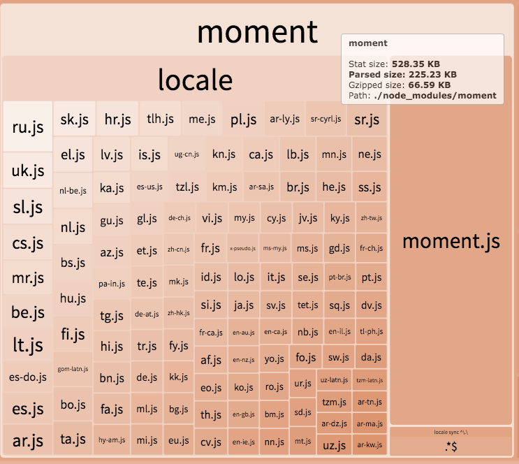

## vue-cli3的配置参考

> 初衷：关于vue-cli3配置参考，google出来的结果大多不理想。所以自己收集捣鼓总结vue-cli3-config-reference。

### :bookmark_tabs:目录
* [:heavy_check_mark:取消eslint错误显示在浏览器中](#:ballot_box_with_check:取消eslint错误显示在浏览器中)
* [:heavy_check_mark:启用bundle分析工具](#:ballot_box_with_check:启用bundle分析工具)
* [:heavy_check_mark:lodash按需引入](#:ballot_box_with_check:lodash按需引入)
* [:heavy_check_mark:moment按需引入语言包](#:ballot_box_with_check:moment按需引入语言包)
* [:heavy_check_mark:启用静态压缩](#:ballot_box_with_check:启用静态压缩)
* DllPlugin配置
* parallel配置
* happyPack配置
* sourceMap配置

### :ballot_box_with_check:取消eslint错误显示在浏览器中
运行```vue create```新建的项目，默认的```lintOnSave:'error'```，lint 错误不仅仅输入到命令行，也直接显示在浏览器中。设置```lintOnSave:true```即可。  
  * true：```eslint-loader``` 会将 lint 错误输出为编译警告。默认情况下，警告仅仅会被输出到命令行，且不会使得编译失败。
  * 'error'：这会强制 ```eslint-loader``` 将 lint 错误输出为编译错误，同时也意味着 lint 错误将会导致编译失败。
  * false：取消eslint检查。
```js
// vue.config.js
module.exports = {
  lintOnSave: true
}
```
tip：修改配置重启后，如无效果，需要Ctrl+s保存文件，触发检查。  
参考：[vue-cli3文档#lintonsave](https://cli.vuejs.org/zh/config/#lintonsave)  

[:arrow_up:回到顶部](#:bookmark_tabs:目录)

### :ballot_box_with_check:启用bundle分析工具
```
$ vue add webpack-bundle-analyzer
```
不需要配置任何script，在build的时候加上--report即可。在开发环境中，默认自动打开```http://127.0.0.1:8888```，查看分析报告，由于 ```webpack-bundle-analyzer``` 需要物理文件来计算已解析和gzip压缩的大小，因此只能使用stat大小；如果运行```npm run build --report```，dist目录下会生成report.html，默认自动打开该文件。  
关闭自动打开分析文件功能：
```js
// vue.config.js
module.exports = {
  pluginOptions: {
    webpackBundleAnalyzer: {
      openAnalyzer: false
    }
  }
}
```
参考：[vue-cli-plugin-webpack-bundle-analyzer](https://www.npmjs.com/package/vue-cli-plugin-webpack-bundle-analyzer)  
[:arrow_up:回到顶部](#:bookmark_tabs:目录)

### :ballot_box_with_check:lodash按需引入
1. 只安装并引入你需要的lodash包
```
$ yarn remove lodash
$ yarn add lodash.clonedeep -S
```
```js
//在需要的地方引入
import cloneDeep from "lodash.clonedeep";
```
2. 使用babel-plugin-lodash
```
$ yarn add babel-plugin-lodash -D
```
修改.babelrc文件：
```json
{
    "plugin":["lodash"]
}
```
3. 使用lodash-es  
webpack的 ```tree-shaking``` 只对es6模块生效，而lodash本身是commonjs模块，所以```import { cloneDeep } from "lodash"```是实现不了按需加载的，但是它有一个lodash-es版本，用的就是es6模块。 
```
$ yarn add lodash-es -S
```
```js
import { cloneDeep } from 'lodash-es' 
// 相当于 import cloneDeep from "lodash.clonedeep";
```
[:arrow_up:回到顶部](#:bookmark_tabs:目录)

### :ballot_box_with_check:moment按需引入语言包
moment支持123种语言，但它又不能事先知道你需要哪一种语言包，保险起见，打包的时候会把所有的语言包打包进去。默认是en，所以en这个语言包是肯定会自动打包进去的。
```js
// 国际化示例
moment.locale('zh-cn')
moment().format('LLL')  // 2019年11月19日早上8点46分

moment.locale('en')
moment().format('LLL')  // November 19, 2019 8:48 AM
```
webpack-bundle-analyzer分析图如下： 

<div align="center"></div>

1. 按需引入语言包  
```js
// vue.config.js，下面只引入中国和中国香港的语言包，可根据自身需求引入
const webpack = require('webpack')

module.exports = {
  chainWebpack: config => {
    config
      .plugin('ignore')
      .use(new webpack.ContextReplacementPlugin(/moment[/\\]locale$/, /(zh-cn)|(zh-hk)$/))
    return config
  }
}
```
2. 忽略所有语言包，并使用import单独引入特定语言包
```js
// vue.config.js
const webpack = require('webpack');
module.exports = {
  chainWebpack: config => {
    config
      .plugin('ignorePlugin')
      .use(webpack.IgnorePlugin, [{     // 引入的文件路径匹配/^\.\/locale$/，则会忽略这个文件， 也就不会被打包进去
        resourceRegExp: /^\.\/locale$/, // 忽略所有语言包，所有locale功能失效，功能缺失那肯定是不允许的。在main.js单独引入语言包即可
        contextRegExp: /moment$/,
      }]);
  }
}
```
```js
//main.js
import moment from 'moment'
import 'moment/locale/zh-cn'
moment.locale('zh-cn')
console.log(moment().format('LLL')) // 2019年11月19日早上8点46分
```
3. 使用date-fns或dayjs替代

|    名字    | 大小(gzip) |支持Tree-shaking|api方法数|时区支持|支持语言数|
| ---------- | ---  |---| ---------- | ---  |---|
| [Moment.js](https://momentjs.com/) |  329K(69.6K) |No|高|非常好|123|
| [date-fns](https://date-fns.org/)       |  78.4k(13.4k) without tree-shaking |YES|高|还不支持|32|
|[dayjs](https://github.com/iamkun/dayjs)|6.5k(2.6k) without plugins|No|中|还不支持|23|

[:arrow_up:回到顶部](#:bookmark_tabs:目录)

### :ballot_box_with_check:启用静态压缩
启用压缩分为动态压缩和静态压缩。
* 动态压缩是由nginx对每个请求进行压缩， 缺点是压缩过程占用cpu的资源，压缩比越高cpu占用越高，不需要修改webpack配置，修改nginx.conf文件即可。
* 静态压缩：使用compression-webpack-plugin对打包文件进行压缩，会生成对应的.gz文件。nginx发现存在对应的.gz文件后，会使用该压缩文件，就不需要自己压缩一遍了。
```
yarn add compression-webpack-plugin -D
```
```js
// vue.config.js
const CompressionPlugin = require('compression-webpack-plugin')
module.exports = {
  configureWebpack: config => {
    if (process.env.NODE_ENV === 'production') {
      config.mode = 'production'
      return {
        plugins: [new CompressionPlugin({
          test: /\.js$|\.html$|\.css/,
          threshold: 10240,//大于10kb的就进行压缩
          deleteOriginalAssets: false //是否删除源文件
        })]
      }
    }
  }
}
```
配置nginx，在http、server、location下加以下代码：
```
# 开启静态压缩
gzip_static on; 
#识别http的协议版本。由于早期的一些浏览器或者http客户端，可能不支持gzip自解压，用户就会看到乱码，所以做一些判断还是有必要的
gzip_http_version   1.1; 
# 启用压缩，如果header包含expired no-cache no-store private auth其中一种
gzip_proxied        expired no-cache no-store private auth; 
# 不启用压缩的条件，IE6对Gzip不友好，所以不压缩
gzip_disable        "MSIE [1-6]\."; 
# 和http头有关系，加个vary头，给代理服务器用的，有的浏览器支持压缩，有的不支持，所以避免浪费不支持的也压缩，所以根据客户端的HTTP头来判断，是否需要压缩
gzip_vary  on;
```
如果使用的是node和express，在需要启用静态压缩的中间件前注册一个中间价即可:
```js
const compression = require('compression')
app.use(compression())
```

[:arrow_up:回到顶部](#:bookmark_tabs:目录)